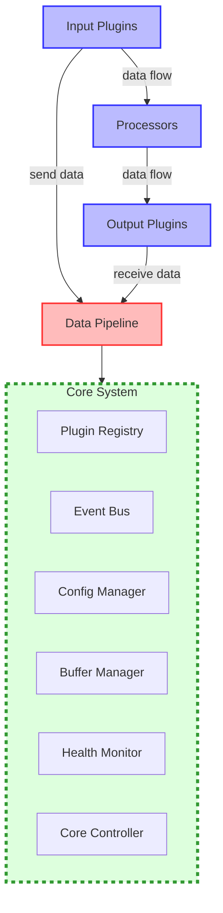
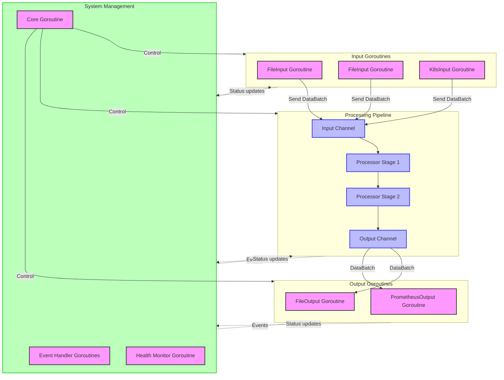
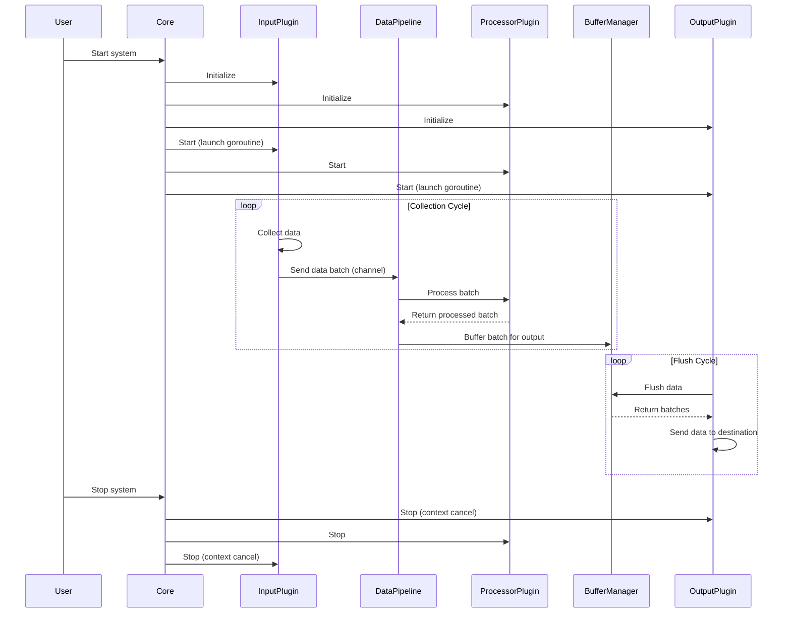

# Observability Collector Architecture (Go Implementation)

## Overview

The Observability Collector is a modular, extensible system designed to collect, process, and export telemetry data (logs, metrics, and traces) from various sources. It follows a pipeline architecture with a plugin-based approach that enables flexibility and customization.

This document describes the overall architecture, core components, data flow, and extension points for the Go implementation.

## Core Architectural Principles

1. **Component-Based Design**: The system is built from loosely coupled components that can be independently developed, tested, and deployed.
2. **Plugin Architecture**: Functionality is extended through plugins (inputs, processors, outputs) that conform to well-defined interfaces.
3. **Pipeline Processing**: Data flows through configurable processing pipelines that transform and route telemetry data.
4. **Event-Driven Communication**: Components communicate through a central event system that decouples producers from consumers.
5. **Buffering and Backpressure**: The system includes built-in buffering and backpressure mechanisms to handle varying data volumes.

## System Architecture Diagram



### Interface Hierarchy Diagram

```mermaid
classDiagram
    %% Define the interface hierarchy
    
    %% Base interfaces
    Component <|-- Plugin
    Component <|-- Core
    Component <|-- ConfigManager
    Component <|-- HealthMonitor
    Component <|-- BufferManager
    Component <|-- DataPipeline
    Component <|-- PluginRegistry
    
    Plugin <|-- InputPlugin
    Plugin <|-- ProcessorPlugin
    Plugin <|-- OutputPlugin
    
    %% Implementation examples
    InputPlugin <|-- FileInput
    ProcessorPlugin <|-- Parser
    OutputPlugin <|-- FileOutput
    OutputPlugin <|-- StdoutOutput
    
    %% Data model
    DataPoint <|.. LogPoint
    DataPoint <|.. MetricPoint
    DataPoint <|.. TracePoint
    
    %% Base interface definitions
    class Component {
        <<interface>>
        +Initialize() bool
        +Start() bool
        +Stop() bool
        +GetStatus() ComponentStatus
        +SetStatus(status ComponentStatus)
        +Configure(config map[string]interface{}) bool
    }
    
    class Plugin {
        <<interface>>
        +GetType() PluginType
        +Validate() bool
        +RegisterWithCore(core *Core) bool
    }
    
    class DataPoint {
        <<interface>>
        +GetTimestamp() time.Time
        +GetOrigin() string
        +GetLabels() map[string]string
        +ToMap() map[string]interface{}
    }
    
    %% Plugin interfaces
    class InputPlugin {
        <<interface>>
        +Collect() []DataBatch
    }
    
    class ProcessorPlugin {
        <<interface>>
        +Process(batch DataBatch) *DataBatch
    }
    
    class OutputPlugin {
        <<interface>>
        +Send(batch DataBatch) bool
    }
    
    %% Implementation structs
    class FileInput {
        +paths []string
        +multilineConfig map[string]interface{}
    }
    
    class Parser {
        +patterns []string
    }
    
    class FileOutput {
        +outputDir string
        +rotateInterval string
    }
    
    class StdoutOutput {
        +colorize bool
        +format string
    }
    
    %% Data structs
    class LogPoint {
        +Timestamp time.Time
        +Origin string
        +Labels map[string]string
        +Message string
        +Level string
        +Attributes map[string]interface{}
    }
    
    class MetricPoint {
        +Timestamp time.Time
        +Origin string
        +Labels map[string]string
        +Name string
        +Value float64
        +MetricType string
        +Dimensions map[string]string
    }
    
    class TracePoint {
        +Timestamp time.Time
        +Origin string
        +Labels map[string]string
        +TraceID string
        +SpanID string
        +ParentSpanID string
        +StartTime time.Time
        +EndTime time.Time
    }
```

### Concurrency Model Diagram



### Component Interactions Sequence Diagram



## Core Components

### Component Interface

All system components implement a common `Component` interface that provides:

```go
// Component represents a core system component with lifecycle management
type Component interface {
    // Initialize prepares the component for operation
    Initialize() bool
    
    // Start begins component operation
    Start() bool
    
    // Stop halts component operation
    Stop() bool
    
    // GetStatus returns the current component status
    GetStatus() ComponentStatus
    
    // SetStatus updates the component status
    SetStatus(status ComponentStatus)
    
    // Configure applies configuration to the component
    Configure(config map[string]interface{}) bool
}
```

### Core System

The `Core` struct coordinates the entire system and manages:

```go
// Core is the central coordinator of the system
type Core struct {
    eventBus       *EventBus
    registry       *PluginRegistry
    pipeline       *DataPipeline
    bufferManager  *BufferManager
    status         ComponentStatus
    config         map[string]interface{}
}

func NewCore() *Core
func (c *Core) Initialize() bool
func (c *Core) Start() bool
func (c *Core) Stop() bool
func (c *Core) RegisterPlugin(plugin Plugin) bool
func (c *Core) PublishEvent(eventType EventType, sourceID string, data interface{})
func (c *Core) ProcessBatch(batch *DataBatch) *DataBatch
```

### Event System

The event system enables loosely coupled communication between components:

```go
// Event represents a system event with metadata
type Event struct {
    Type      EventType
    SourceID  string
    Data      interface{}
    Timestamp time.Time
}

// EventBus handles event publication and subscription
type EventBus struct {
    subscribers map[EventType]map[string]func(Event)
    mutex       sync.RWMutex
}

func NewEventBus() *EventBus
func (b *EventBus) Subscribe(eventType EventType, listenerID string, callback func(Event))
func (b *EventBus) Publish(event Event)
```

### Configuration Management

The `ConfigManager` handles system configuration:

```go
// ConfigManager handles loading, storing, and accessing configuration
type ConfigManager struct {
    config     map[string]interface{}
    watchers   map[string][]func(interface{})
    mutex      sync.RWMutex
}

func NewConfigManager() *ConfigManager
func (m *ConfigManager) LoadConfig(configFile string) bool
func (m *ConfigManager) SaveConfig(configFile string) bool
func (m *ConfigManager) GetConfig(path string, defaultValue interface{}) interface{}
func (m *ConfigManager) SetConfig(path string, value interface{}) bool
func (m *ConfigManager) WatchConfig(path string, callback func(interface{}))
```

### Health Monitoring

The `HealthMonitor` tracks system health:

```go
// HealthMonitor tracks system and component health
type HealthMonitor struct {
    status    ComponentStatus
    metrics   map[string]interface{}
    mutex     sync.RWMutex
}

func NewHealthMonitor() *HealthMonitor
func (h *HealthMonitor) GetHealthStatus() HealthStatus
func (h *HealthMonitor) AddMetric(name string, value interface{}, metadata map[string]interface{})
```

### Buffer Management

The `BufferManager` handles data buffering between components:

```go
// BufferManager handles data buffering and backpressure
type BufferManager struct {
    buffers   map[string][]DataBatch
    status    BufferStatus
    mutex     sync.RWMutex
}

func NewBufferManager() *BufferManager
func (b *BufferManager) Buffer(outputID string, batch DataBatch) bool
func (b *BufferManager) Flush(outputID string, maxBatches int) []DataBatch
func (b *BufferManager) GetBufferStatus() BufferStatus
```

## Data Model

### Data Points

The system uses interfaces for telemetry data points:

```go
// DataPoint represents a single telemetry data point
type DataPoint interface {
    // GetTimestamp returns the time the data point was created
    GetTimestamp() time.Time
    
    // GetOrigin returns the source of the data point
    GetOrigin() string
    
    // GetLabels returns metadata labels for the data point
    GetLabels() map[string]string
    
    // ToMap converts the data point to a map representation
    ToMap() map[string]interface{}
}

// LogPoint represents a log entry
type LogPoint struct {
    Timestamp time.Time
    Origin    string
    Labels    map[string]string
    Message   string
    Level     string
    Attributes map[string]interface{}
}

// MetricPoint represents a metric measurement
type MetricPoint struct {
    Timestamp   time.Time
    Origin      string
    Labels      map[string]string
    Name        string
    Value       float64
    MetricType  string
    Dimensions  map[string]string
}

// TracePoint represents a trace span
type TracePoint struct {
    Timestamp     time.Time
    Origin        string
    Labels        map[string]string
    TraceID       string
    SpanID        string
    ParentSpanID  string
    StartTime     time.Time
    EndTime       time.Time
}
```

### Data Batch

A container for multiple data points:

```go
// DataBatch is a collection of data points of the same type
type DataBatch struct {
    BatchType TelemetryType
    Points    []DataPoint
    Metadata  map[string]interface{}
}

func NewDataBatch(batchType TelemetryType) *DataBatch
func (b *DataBatch) AddPoint(point DataPoint)
func (b *DataBatch) Size() int
func (b *DataBatch) ToMap() map[string]interface{}
```

## Plugin System

### Plugin Interface

All plugins implement the `Plugin` interface:

```go
// Plugin is the base interface for all plugins
type Plugin interface {
    Component
    
    // GetType returns the plugin type
    GetType() PluginType
    
    // Validate checks if the plugin is properly configured
    Validate() bool
    
    // RegisterWithCore registers the plugin with the core system
    RegisterWithCore(core *Core) bool
}
```

### Plugin Registry

The `PluginRegistry` manages plugin registration and lookup:

```go
// PluginRegistry keeps track of available plugins
type PluginRegistry struct {
    plugins map[string]Plugin
    mutex   sync.RWMutex
}

func NewPluginRegistry() *PluginRegistry
func (r *PluginRegistry) RegisterPlugin(plugin Plugin) bool
func (r *PluginRegistry) UnregisterPlugin(pluginID string) bool
func (r *PluginRegistry) GetPlugin(pluginID string) (Plugin, bool)
func (r *PluginRegistry) GetPluginsByType(pluginType PluginType) []Plugin
```

### Plugin Type Interfaces

```go
// InputPlugin collects data from sources
type InputPlugin interface {
    Plugin
    
    // Collect gathers data from the source
    Collect() []DataBatch
}

// ProcessorPlugin transforms data
type ProcessorPlugin interface {
    Plugin
    
    // Process transforms a data batch
    Process(batch DataBatch) *DataBatch
}

// OutputPlugin exports data to destinations
type OutputPlugin interface {
    Plugin
    
    // Send exports a data batch
    Send(batch DataBatch) bool
}
```

## Pipeline System

The pipeline system manages data flow:

```go
// PipelineStage represents a single processing step
type PipelineStage struct {
    Processor ProcessorPlugin
    NextStage *PipelineStage
}

func (s *PipelineStage) Process(batch DataBatch) *DataBatch

// DataPipeline manages the processing pipeline
type DataPipeline struct {
    pipelines map[TelemetryType]*PipelineStage
    mutex     sync.RWMutex
}

func NewDataPipeline() *DataPipeline
func (p *DataPipeline) AddProcessor(processor ProcessorPlugin) bool
func (p *DataPipeline) CreatePipeline(telemetryType TelemetryType, processorIDs []string) bool
func (p *DataPipeline) Process(batch DataBatch) *DataBatch
```

## Example Plugin Implementations

### File Input

```go
// FileInput reads log data from files
type FileInput struct {
    id              string
    name            string
    status          ComponentStatus
    config          map[string]interface{}
    paths           []string
    multilineConfig map[string]interface{}
    core            *Core
}

func NewFileInput(id string) *FileInput
func (f *FileInput) Initialize() bool
func (f *FileInput) Start() bool
func (f *FileInput) Stop() bool
func (f *FileInput) GetType() PluginType
func (f *FileInput) Collect() []DataBatch
```

### Parser Processor

```go
// Parser processes raw logs into structured format
type Parser struct {
    id       string
    name     string
    status   ComponentStatus
    config   map[string]interface{}
    patterns []string
    core     *Core
}

func NewParser(id string) *Parser
func (p *Parser) Initialize() bool
func (p *Parser) Process(batch DataBatch) *DataBatch
```

### File Output

```go
// FileOutput writes data to files
type FileOutput struct {
    id            string
    name          string
    status        ComponentStatus
    config        map[string]interface{}
    outputDir     string
    rotateInterval string
    core          *Core
}

func NewFileOutput(id string) *FileOutput
func (f *FileOutput) Initialize() bool
func (f *FileOutput) Send(batch DataBatch) bool
```

## Configuration

The system uses a JSON configuration file with the same structure as the Python implementation:

```json
{
  "system": {
    "id": "observability-collector",
    "version": "1.0.0",
    "log_level": "INFO"
  },
  "plugins": {
    "inputs": [...],
    "processors": [...],
    "outputs": [...]
  },
  "pipelines": {
    "logs": {
      "inputs": ["file-input"],
      "processors": ["log-parser"],
      "outputs": ["file-output"]
    },
    "metrics": {
      "inputs": ["kubernetes-input"],
      "processors": [],
      "outputs": ["prometheus-output"]
    }
  }
}
```

## Command-Line Interface

The Go implementation provides a similar command-line interface:

```
Usage: observability_collector [options]

Options:
  --config string        Path to configuration file
  --input-file string    Process a specific input file
  --output-dir string    Output directory for file output
  --stdout               Output to stdout instead of files
  --color                Colorize stdout output
  --json                 Output in JSON format
  --one-shot             Process files once and exit
```

## Extension Points

The system provides the same extension points as the Python implementation:

1. Create new Input Plugins by implementing the `InputPlugin` interface
2. Create new Processor Plugins by implementing the `ProcessorPlugin` interface
3. Create new Output Plugins by implementing the `OutputPlugin` interface
4. Add new core components by implementing the `Component` interface

Example of a custom plugin:

```go
// MyCustomInput is an example of a custom input plugin
type MyCustomInput struct {
    id     string
    name   string
    status ComponentStatus
    config map[string]interface{}
    core   *Core
}

func NewMyCustomInput(id string) *MyCustomInput {
    return &MyCustomInput{
        id:   id,
        name: "MyCustomInput",
    }
}

func (m *MyCustomInput) GetType() PluginType {
    return InputPluginType
}

func (m *MyCustomInput) Collect() []DataBatch {
    // Implement custom collection logic
    batch := NewDataBatch(LogTelemetryType)
    // Add data points to the batch
    return []DataBatch{*batch}
}

func (m *MyCustomInput) Validate() bool {
    // Validate plugin configuration
    return true
}
```

## Error Handling and Performance

The Go implementation maintains the same approach to error handling, resilience, and performance optimization as described in the Python implementation, while leveraging Go's concurrency model:

1. **Goroutines**: Input and output plugins use goroutines for concurrent operation
2. **Channels**: Used for communicating between components and handling backpressure
3. **Context**: Used for cancellation and timeouts

## Conclusion

The Go implementation of the Observability Collector maintains the same flexible, extensible architecture as the Python version while leveraging Go's performance characteristics and concurrency model. It provides a robust framework for collecting, processing, and exporting telemetry data with a focus on performance and reliability.